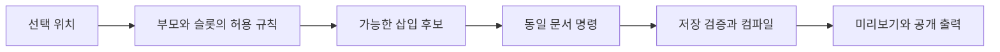

# 페이지 편집 정책 — 현행 개발 기준

<!-- editor-policy:editor-maturity-20260907 -->

상태: **2026-09-07 현행 개발 정책**. 대상은 G7 운영자·사이트 제작자의 페이지 편집 기능 고도화입니다. 사용자 지시에 따라 경쟁 조사 결과를 개발 기준에 반영했습니다. 아래 **목표 계약**은 개발해야 할 기능이며 문서 반영만으로 현재 runtime 지원이 되지 않습니다.

- 실행 순서: [편집 고도화 실행 계획](editor-plan.md). 현재 진척: [상태판](editor-progress.md), 원장 `editor-progress.json`.
- 근거: [공식 출처 31개](editor-policy-sources.md), [기준 재고 45종+구조3종](editor-library-inventory.csv).
- 상위 경계: [개발 헌법](../development-constitution.md), `AGENTS.md`. 필드의 현행 구현: [캔버스 계약](../canvas-editing-contract.md).
- 옛 productization 1~8차와 site 1~5차는 실행 이력입니다. 현재 EP1~EP4의 진척과 합산하지 않습니다.

## 현재 지원과 목표를 구별합니다

기준 소스 SHA는 `58ed8a33829fdcb1327d730c6ab6da953f656949`입니다. 현재 내장 정의45종·preset95종이며, 호환 전용 HeroSplit 정의1개를 숨겨 기본 갤러리 후보는139개입니다. 외부 팩 포함 실환경 총수나 품질 합격 수가 아닙니다. 구조3종은 별도 등록입니다.

현재도 직접 텍스트·미디어·링크 편집, 반복 항목, 구조 트리·Undo·반응형 설정·개인 패턴·SitePart가 있습니다. 빠진 것은 제작 단위에 맞는 분류와 문맥별 후보, 복합 컴포넌트의 명시적 내부 슬롯입니다. 상세 상태/근거는 진척 원장의 baseline에 기록하며 새 작업 완료 수로 재계산하지 않습니다.

현재 `BlockResponsiveOverride`는 **layout/appearance**를 지원합니다. `appearance.elements`의 일반 요소 스타일과 기기별 element override는 같은 기능이 아닙니다. 후자를 이미 지원한다고 표시하거나 이번 범위에 암묵적으로 추가하지 않습니다.

EP1-01의 분류 구현은 [실행 기록](../audits/2026-09-07-editor-ep1-01.md)에 연결합니다. 제작 단위는 `blockGalleryModel`의 읽기 모델에서 한 번만 분류하고 양쪽 삽입 UI가 사용합니다. manifest/API 버전과 저장 원본은 바꾸지 않습니다. 구형 데이터 팩은 기반 타입의 제작 단위를 유지하고 자체 코드 팩은 컴포넌트로 보수적으로 표시하며, 직접 편집/내부 슬롯 미선언은 지원으로 추정하지 않습니다. 구조3종 중 구역은 구조 편집 활성화 후 라이브러리에서, 열/세로 묶음은 기존 구역 설정에서 추가합니다. 이 분류 반영이 뒤의 목표 슬롯 구현을 완료한 것은 아닙니다.

## 계약별 소유 원천

| 정보 | 원천 | 소비 경계 |
|---|---|---|
| ID·버전·schema·compiler·capability | 기존 Pack manifest와 BlockRegistry | 로딩·저장·컴파일 |
| 화면 필드·직접 편집·반복 한도 | canvasEditingContract와 기존 collectionLimit | 캔버스·문맥 도구·Inspector |
| 부모/자식·슬롯·깊이 | 버전된 layout-policy와 TS/PHP 공통 fixture | 모든 문서 명령·변환·저장·출력 |
| 타입별 의미 스타일 | BlockAppearance·fontSize·pageDesignTokens | 필드·편집 CSS·PHP 출력 |
| 제작 단위와 표시 분류 | 기존 descriptor/manifest의 확장 또는 그로부터 만든 읽기 모델 | 드로어·갤러리·문맥 삽입 |
| 진척·검증 연결 | editor-progress.json | 상태판·문서 검사; runtime 계약으로 사용하지 않음 |

기존 원천을 복사한 두 번째 블록 메타데이터 원장을 만들지 않습니다. 새 UI가 필요해도 Puck/Tiptap·문서 변경 명령·저장 엔진을 재구현하지 않습니다. 외부 팩 capability 부재는 해당 선택지에만 영향을 주며 정상 문서와 마지막 발행본을 보존합니다.

## 현재 구현 문법과 보존 규칙

등록된 구조 ID는 `layout.section-01`, `layout.columns-01`, `layout.stack-01`이며 현재 `block_version=1`입니다. 아래 표는 현재 지원이고 뒤의 P-06 표는 목표 확장입니다.

기본 leaf 허용 목록은 현재 ID `content.heading-01`, `content.rich-text-01`, `media.image-01`, `action.buttons-01`, `content.divider-01`의 5종입니다. Buttons의 자체 반복 목록은 기존 최소/최대를 유지합니다.

| 부모 | slot | 허용 자식 |
|---|---|---|
| 문서 root | blocks | 기존 v1 block 45종의 호환 인스턴스 또는 Section |
| Section | content | Columns, Stack, 기본 leaf |
| Columns | column1 / column2 / column3 중 활성 열 | Stack, 기본 leaf |
| Stack | content | 기본 leaf |
| 기본 leaf·기존 복합 블록 | 없음 | 자식 없음 |

- root에 Columns/Stack을 직접 넣지 않습니다. Section 안의 Section, Columns 안의 Columns, Stack 안의 Stack도 금지합니다.
- 최대 경로는 Section → Columns → Stack → leaf입니다. root를 제외한 노드 깊이는 4입니다.
- 열은 1/2/3열입니다. 비율은 1열 `1`, 2열 `1:1`, `1:2`, `2:1`, 3열 `1:1:1`만 허용합니다. 자유 수치 grid를 받지 않습니다.
- slot 이름은 안정적인 위치 식별자입니다. 열 순서를 바꾸더라도 노드 instance ID·내용·스타일은 보존합니다. Puck 전용 ID는 원본에 저장하지 않습니다.
- 빈 컨테이너는 합법입니다. 첫 자식 삽입과 drop 영역을 제공하며 빈 상태 안내는 발행 HTML에 출력하지 않습니다.
- 선언이 없거나 활성 열이 아닌 slot이면 삽입·이동·API 저장 모두 거부합니다.
- 현재 5종 leaf와 세 구조 타입의 전체 표가 연결돼 있습니다. 이 사실이 기존 복합 블록 내부 슬롯의 지원을 뜻하지는 않습니다.

### 내용 보존과 이력

- 자기 하위로 이동 금지. 이동은 기존 UUID, 복제/패턴 삽입은 subtree 전체 새 UUID를 사용합니다.
- 3→2열 축소는 제거될 열이 비어 있으면 즉시 처리합니다. 내용이 있으면 이동 대상과 결과를 확인한 후 제거될 열의 내용을 원래 순서대로 마지막 남은 열 끝에 합칩니다.
- 노드/slot 한도를 넘으면 작업 전체를 거부합니다. 부분 이동·자동 내용 삭제는 없습니다. 취소는 문서·선택·이력 모두 기존 상태를 유지합니다.
- 구조 삭제는 영향받는 하위 항목 수를 보여주고 확인합니다. 한 번의 명시적 구조 명령을 한 Undo로 되돌리는 것은 수용 기준 UND-01입니다. 빠른 연속 명령 전체의 보장은 관련 브라우저 증거로 확인하며 과거 자동저장 간격 시험만으로 확대하지 않습니다.

### v2 안전 한도

- 문서 전체 최대 500개 노드. root와 모든 slot의 노드를 합산하며 반복 props 항목은 해당 블록 한도로 따로 검증합니다.
- slot당 최대 200개 자식. 깊이는 위 허용표로 제한합니다.
- 원본 JSON은 compact UTF-8 직렬화 기준 1 MiB(1,048,576 bytes) 이하. 이미지 바이너리·base64는 넣지 않습니다. HTTP transport의 별도 제한을 대체하지 않습니다.
- 길이 판정용 직렬화는 불필요한 공백 없이 Unicode·슬래시를 그대로 쓰는 동일 규칙을 TS/PHP에 적용합니다. 한글·이모지·숫자·이스케이프가 포함된 공통 byte-boundary fixture로 일치를 확인하며 JS 문자 수를 byte 수로 대신하지 않습니다.
- 이 수치는 업계 표준/성능 보증이 아닌 현재 방어 한도입니다. TS/PHP 공통 경계와 실제 출력은 변경 영향의 관련 검사로 보존합니다. 상향은 대표 요구와 계약 변경 근거가 필요합니다.
- v1에 새 한도를 소급 적용하지 않습니다. 한도 초과 v1의 v2 전환은 명시적으로 거부하고 v1 읽기·편집·기존 공개를 유지합니다.

## 삽입 분류 정책

**정책 P-01:** 사용자 삽입 메뉴의 1차 분류는 제작 단위로 통일한다. 용도·출처·즐겨찾기는 별도의 필터다. 좌측 드로어와 상세 라이브러리는 같은 분류 원천을 사용한다.

| 1차 분류 | 의미 | 예시 | 삽입 결과 |
|---|---|---|---|
| 기본 요소 | 한 가지 콘텐츠 역할을 갖는 작은 단위 | 제목, 본문, 이미지, 버튼, 아이콘, 목록, 배지, 구분선 | 하나의 요소 또는 의미가 같은 기존 노드 표현 |
| 레이아웃 | 다른 요소를 담고 정렬하는 구조 | 구역, 1/2/3열, 세로 묶음 | 허용 슬롯을 가진 컨테이너 |
| 컴포넌트 | 콘텐츠와 고정된 의미/동작을 함께 갖는 조합 | 카드, 이미지+본문, 안내, 탭, FAQ, 영상, 게시판 목록, 문의 폼 | 공개 필드와 허용 슬롯이 있는 구성요소 |
| 완성 섹션 | 한 페이지 구역으로 사용할 준비된 구성 | Hero, 서비스 소개, 가격표, 후기, CTA | 검증된 콘텐츠/구조의 독립 복사본 |

`G7 연동`, `탐색`, `미디어`, `문의`, `회사·신뢰`는 컴포넌트/섹션의 **용도 필터**다. `기본 제공/외부 팩/내가 저장`은 **출처**다. `기본형/변형`은 **프리셋 상태**다. 이런 축을 동일한 한 줄 분류로 섞지 않는다.

- 페이지·사이트 킷은 기존 `페이지 시작` 경로에서 선택한다. 텍스트와 같은 드롭 후보로 넣지 않는다.
- `내 보관함`은 저장한 구역을 찾는 진입점이다. 저장됐다는 사실이 새 콘텐츠 종류를 의미하지 않는다.
- 페이지 Header/Footer는 공통영역 작업 대상으로 유지하며 일반 본문에 무제한 중첩시키지 않는다.
- 버튼 기본형은 기존 Buttons의 1개 항목으로 제공할 수 있다. 이를 이유로 단일 버튼 전용 원본 ID를 즉시 신설할 필요는 없다. 버튼 묶음은 같은 계약의 2~3개 표현이다.
- 제목·버튼 preset은 해당 요소의 `스타일/예제` 선택지로 이동한다. 기술적 preset이라는 이유만으로 완성 섹션에 넣지 않는다.
- 기존 ID·문서를 삭제하거나 이름만 바꿔 개수가 늘어난 것처럼 보고하지 않는다.

**정책 P-02:** 선택 위치에 삽입 가능한 항목을 우선 표시한다. `전체 보기`에서 불가능한 항목은 이유를 설명할 수 있으나 실패할 항목을 정상 후보처럼 제시하지 않는다. 드래그, 클릭 삽입, 트리 이동, 복제, 붙여넣기, API 저장은 같은 부모/자식 규칙을 따른다. [Webflow Slots](https://help.webflow.com/hc/en-us/articles/33961195339923-Slots), [WordPress InnerBlocks](https://developer.wordpress.org/block-editor/how-to-guides/block-tutorial/nested-blocks-inner-blocks/).

EP1-02 구현에서는 선택 컨테이너의 첫 활성 슬롯 또는 선택 요소 뒤를 기본 위치로 사용하며, 호환되지 않는 항목을 컨테이너 밖으로 자동 우회시키지 않습니다. 사용자가 `추가할 위치`에서 활성 열·다른 구역·페이지 최상위를 명시적으로 선택합니다. 기본 목록은 삽입 가능한 항목이고, `삽입 불가 항목도 보기`에서 비활성 버튼과 이유를 확인합니다. 위치 목록/부모 선택/이동 명령은 같은 현재 트리에서 계산하고, 기본 구역의 전체 자식과 복제 subtree를 개수·깊이 검사에 포함합니다. Puck 드래그·트리 명령도 기존 canonical 경계와 PHP 저장 검증을 통과해야 합니다. 실제 완료와 CAT-02/INS-01/POL-01 증거는 진척 원장에서 확인합니다.

## 기본 제공 목록과 신규 개발의 경계

아래 목록은 현행 목표 제공 목록이며 경쟁사 기능 수를 복제한 결과가 아니다. 현재 부족한 작은 단위, 기존 재사용 가능성, 운영 사이트의 편집 목적을 반영한 **G7의 기본 제공 개발 기준**이다. 새 항목이 현재 구현돼 있다는 뜻도 아니다.

| 기본 요소 | 현재 | 제공/편집 경계 |
|---|---|---|
| 제목 | 있음 | 문구·의미 있는 heading level·타이포그래피·anchor. 임의 HTML 태그 아님. |
| 본문 | 있음 | 허용된 리치텍스트와 링크. 붙여넣기 원시 HTML/스크립트 유지 금지. |
| 이미지 | 있음 | 업로드/교체·비우기·alt·비율·정해진 맞춤·링크. 개별 HTML/CSS 입력은 제공하지 않음. |
| 버튼 | Buttons 1개로 표현 가능 | 문구·검증된 링크·크기/외형·정렬. 클릭 JS·인증 처리 편집 금지. |
| 구분선 | 있음 | 정해진 선·간격·색상. 여백을 만들기 위한 빈 텍스트 남용 방지. |
| 아이콘 | 독립 삽입 없음 | 검증된 아이콘 선택·크기·색·장식 여부/접근성 이름. SVG 코드 입력 금지. |
| 목록 | RichText 내부 목록은 있음. 독립 단순 목록 타입은 없음 | 순서/비순서 목록·항목 문구·순서·들여쓰기 제한. 별도 삽입 진입점은 먼저 기존 RichText 표현 재사용을 검토. IconList 조합과 구별. |
| 배지 | 독립 삽입 없음 | 짧은 문구·선택 아이콘·의미 색상/크기. 초기에는 정적 표시만 제공. |

**기본 요소는 위 8종을 목표 목록으로 잡는다. 신규 개발 후보는 기본 요소 3종(아이콘·목록·배지)과 컴포넌트 1종(단일 카드)이다.** 현재 CardGrid는 최소 2개이므로 단일 카드와 같은 기능이라고 처리하지 않는다. 4개 새 ID 신설을 미리 확정하는 뜻은 아니다. 목록의 RichText 재사용 등을 먼저 검토해 새 원본 타입은 필요한 경우에만 만든다. 기존 본문의 목록 기능은 [리치텍스트 계약](../../resources/js/editor/richTextEditing.tsx)에서 확인했다.

| 컴포넌트 제공 범위 | 현재 자산을 활용하는 방식 | 고도화 경계 |
|---|---|---|
| 카드·이미지+본문 | CardGrid와 ImageText의 콘텐츠/스타일 재사용 가능성 검토 | 단일 카드와 허용된 내부 body/actions 영역부터 제공 |
| 안내·인용·연락처·목록 | 기존 타입 유지 | 공개 필드와 타입별 스타일만 노출 |
| FAQ·탭 | 기존 동작 유지 | 제목/항목 설정과 본문 슬롯을 구별해 제한적으로 개방 |
| 이미지 캐러셀·영상·갤러리 | 기존 미디어 계약 유지 | 허용 미디어/문구/재생 설정만 제공. 슬라이드 안 또 다른 슬라이더는 기본 제공하지 않음 |
| 탐색·표·차트 | 기존 타입 유지 | 데이터·문구·레이아웃 선택. 임의 DOM/접근성 구조 편집 금지 |
| G7 데이터·문의·지도 | 기존 공개 Adapter와 고정 runtime 유지 | 배치·표현·공개 설정만 편집. endpoint/handler/auth/DB 소유권은 문서에 노출하지 않음 |

페이지 빌더용 독립 input/select/checkbox와 임의 폼 처리 엔진, 모달·팝업 워크플로, 애니메이션 타임라인, 코드 컴포넌트 제작 UI, 외부 UI 패키지 가져오기는 이번 제공 목록에서 보류한다. 폼의 현재 필수 이름/이메일·동의·전송 동작을 일반 장식 요소처럼 삭제할 수 있게 하지 않는다.

### EP2-01 원본 계약 결정 (구현 진행 중)

목록은 `content.list-01@1`로 분리합니다. 현재 RichText는 문단·제목·목록을 혼합하므로 그 ID만으로 카드 body/extra의 목록 역할과 개수 한도를 검증할 수 없습니다. 기존 `content.rich-text-01` 및 IconList의 저장·출력은 유지합니다. 새 목록은 순서/비순서, 1~20개 항목, 항목당 비어 있지 않은 일반 텍스트 200자, 1단 깊이로 제한합니다. 항목 추가·이동·복제·삭제는 기존 반복 항목 도구를 사용합니다.

`content.icon-01@1`은 기존 검증된 11종 아이콘, small/medium/large 크기, default/muted/accent 의미 색상만 제공합니다. 장식은 접근성 트리에서 숨기고, 의미 전달은 120자 이내의 비어 있지 않은 접근성 이름을 요구합니다. `content.badge-01@1`은 40자 이내의 필수 일반 문구, 선택 아이콘, 같은 크기·색상을 사용합니다. 배지는 정적 표시이며 링크·버튼·실시간 상태 역할을 갖지 않습니다. 아이콘 그림은 기존 모듈의 검증된 아이콘 렌더러를 사용하고 사용자 SVG/HTML/JS를 받지 않습니다.

세 타입은 자식 슬롯이 없는 기본 요소입니다. 목록 항목과 배지 문구는 캔버스에서, 아이콘 선택·접근성 이름·목록 형식·크기·색상은 설정 패널에서 편집합니다. 공통 여백·배경·정렬·반응형 상속과 발행 경계는 기존 계약을 사용합니다. 실제 완료 여부는 EP2-01 진척 원장과 [차수 증거](../audits/2026-09-07-editor-ep2-01.md)를 따릅니다.

## 편집 UX 정책: 한 화면, 명확한 선택 범위

**정책 P-03:** 기본은 콘텐츠 편집이다. 블록을 추가한 뒤 새 편집 화면으로 이동하지 않는다. 텍스트 영역은 기존 인라인 입력을 유지하고, 블록 테두리/손잡이·구조 트리는 컨테이너 선택 경로로 구분한다. 단순 문구 수정에 구조 편집 모드를 강요하지 않는다.

| 조작 | 주 도구 | 보조 도구와 경계 |
|---|---|---|
| 문구 수정·글자 일부 서식 | 캔버스 직접 입력/범위 툴바 | 대체 입력이 필요하면 동일 필드를 조작하는 명시적 진입점으로 제공. 리치텍스트 입력면을 양쪽에 동시에 열지 않음 |
| 이미지·링크 교체 | 선택 대상의 문맥 도구 → picker | 우측 패널에서도 같은 picker/명령을 사용 |
| 색·글꼴·간격·정렬 | 우측 `스타일` 패널 | 자주 쓰는 동작만 문맥 도구. 모든 블록에 빈 만능 패널을 노출하지 않음 |
| 반복 항목 추가·순서·복제·삭제 | 선택 항목 도구/목록 패널 | 카드 항목과 내부 요소의 선택을 명확하게 구분 |
| 컴포넌트 내부 슬롯 구성 | 같은 캔버스의 `내부 구성` 상태 | 허용 슬롯만 강조. 다른 페이지로 전환하거나 별도 문서를 저장하지 않음 |
| 데이터·URL·alt·표시 조건 | 우측 `설정` 패널 | 실제 콘텐츠와 샘플/실시간 데이터 상태를 구분 |

현재 리치텍스트의 중복 우측 필드는 숨겨져 있다. 대체 입력 진입점은 접근성 시나리오에서 필요성을 확인해 추가할 대상이며 이미 제공된 기능으로 세지 않는다. 저장 필드·Tiptap 상태·Undo를 복제한 두 번째 입력 엔진을 만들지 않는다.

**정책 P-04:** 선택 경로를 `페이지 > 구역 > 카드 > 본문`처럼 표시하고 부모 선택과 빠져나가기를 제공한다. 내부 구성 중에도 변경은 동일 canonical 문서·동일 Undo 이력에 기록한다. 탭/아코디언의 `동작 확인`과 편집 대상 선택을 구분해 편집 클릭으로 링크 이동·폼 제출이 일어나지 않게 한다.

**정책 P-05:** 드래그만으로 끝내지 않는다. 클릭 추가와 `이동할 위치` 명령, 키보드 조작을 함께 제공한다. 이는 기존 Puck/명령을 재사용한다. WCAG의 드래그 동작 기준은 드래그 없는 단일 포인터 대안을 요구하며, 키보드 지원도 별도로 다뤄야 한다. [WCAG Dragging Movements](https://www.w3.org/WAI/WCAG22/Understanding/dragging-movements.html).

## 타입별 수정 가능 경계

**정책 P-06:** 모든 타입은 다음 다섯 항목을 선언해야 라이브러리에 노출한다: `직접 편집 필드 / 스타일 옵션 / 반복 항목 / 허용 슬롯 / 고정 동작`. “편집 가능”이라는 Boolean 하나로 표시하지 않는다. 사용자 화면은 `내용 수정`, `항목 추가`, `내부 구성`처럼 이해할 수 있는 동작으로 표시하고 가능한 도구만 노출한다. block ID·schema·handler 같은 내부 계약 정보를 설정 항목으로 나열하지 않는다.

| 대상 | 내용·스타일·반복 편집 | 열어 줄 슬롯/구조 | 고정할 부분 |
|---|---|---|---|
| 제목·본문·이미지·버튼 | 각 요소의 공개 필드 | 자식 컨테이너 없음 | 의미 태그·링크 정제·접근성 기본 |
| 일반 구역·열·Stack | 폭·간격·정렬·열 수·정해진 비율 | 명시된 부모/자식 허용표 | 깊이/노드 상한, DOM 읽기 순서 |
| Hero·이미지+본문 | 제목·설명·미디어·배치 변형 | 설명 보강 영역과 actions 등 이름 있는 슬롯부터 | 전체 구조를 임의 HTML로 분해하는 기능, 배경 장식 DOM |
| 단일 카드 | 문구·미디어·외형 변형 | media: 이미지, body: 텍스트/아이콘/목록/배지/구분선, actions: 버튼 묶음 | 링크로 감싼 카드 안의 중첩 링크/버튼 등 잘못된 HTML 구조 |
| 카드 목록·가격표·팀 등 | 기존 항목 추가/이동/복제/삭제와 공개 필드 유지 | EP1~EP4에서 추가 내부 슬롯은 열지 않음; 필요 시 후속 정책 검토 | 항목마다 다른 임의 DOM 구조를 자동 허용하지 않음 |
| 탭·FAQ | 제목·항목·초기 표시·허용 스타일 | 항목 본문에 기본 요소와 검증된 카드/이미지+본문 | 탭 역할·ID 관계·키보드·포커스·개폐 엔진 |
| 슬라이더 | 기존 장면·미디어·문구·정해진 재생 옵션 유지 | EP1~EP4에서 추가 내부 슬롯은 열지 않음; 현재 반복/필드 계약 사용 | 중첩 슬라이더·임의 autoplay 스크립트 |
| G7 목록/상세 | 소스 선택·필터·개수·정해진 표시 형식 | 일반 구역/열/Stack에 독립 컴포넌트로 배치 | 실제 게시글/상품 내용을 페이지 문구처럼 수정, endpoint·인증·정렬 SQL |
| 문의 폼 | 문구·공개 필드 표시·상태 문구·외형 | 일반 레이아웃 안에 폼 전체 배치 | 제출/검증/동의 처리·필수 식별 필드·nested form |
| 헤더·푸터 | 기존 브랜드·메뉴·허용 배치·스타일 | SitePart의 명시된 슬롯만 | G7 계정·검색·장바구니 등의 고정 runtime |

위 슬롯 정책은 **목표 계약**이다. 현재 슬롯이 없는 기존 복합 블록이 재분류만으로 이 능력을 얻는 것은 아니다. 첫 구현은 대표 Hero·이미지+본문·단일 카드에 한정해 계약과 편집 동작을 검증하고, 동일 패턴이 성립한 뒤 다른 유형에 적용한다. 첫 구현의 정식 작업 ID는 EP2-02(단일 카드)·EP2-03(Hero/ImageText)다. 이어 EP3-01에서 탭/FAQ를 확장한다. 카드 목록·가격표·팀·슬라이더의 신규 내부 슬롯은 이 계획의 완료 범위가 아니다.

초기에는 폼/G7 데이터 컴포넌트를 탭·FAQ·슬라이더 안에까지 넣는 조합을 열지 않는다. 일반 레이아웃의 조합부터 검증한다. 이를 영구 금지로 고정하지 않고 새 시나리오·접근성·데이터 수명 검증을 거쳐 명시적으로 확장한다.

### 첫 구현의 삽입 허용표

다음은 EP2의 **목표 허용표**다. 분류 이름만 바꾼 EP1에서 자동으로 개방하지 않는다.

| 부모/위치 | 허용 대상 | 처음에는 열지 않을 대상 |
|---|---|---|
| 페이지 root | 기존 정상 삽입 대상 + Section + 신규 기본 요소/단일 카드 | 호환 전용 HeroSplit의 신규 삽입, root Columns/Stack |
| Section | Columns·Stack·기본 요소 8종·단일 카드·ImageText | 완성 섹션과 나머지 컴포넌트 일괄 개방 |
| Columns의 열 | Stack·기본 요소 8종·단일 카드·ImageText | Columns 안 Columns, Section 재중첩 |
| Stack | 기본 요소 8종·단일 카드·ImageText | Stack 안 Stack, 일반 레이아웃의 무제한 재귀 |
| 카드/Hero/ImageText 내부 | 아래 지정 슬롯의 허용 요소 | 일반 컴포넌트/섹션/레이아웃 전체 |

깊이는 **삽입되는 하위 트리 전체를 포함해 현재 상한 4를 검사**한다. 예를 들어 `Section → Columns → Card → 기본 요소`는 상한 안이지만 그 사이에 Stack을 더 넣으면 초과한다. 이 경우 불가능한 후보와 원인을 먼저 표시한다. 대표 요구가 이 제한 때문에 실질적으로 막히는 경우에만 깊이 변경을 별도 검토한다.

| 첫 대표 대상 | 고정 필드/교체 대상 | 개방할 슬롯과 한도 |
|---|---|---|
| 단일 카드 | 카드 외형·배치·전체 링크 정책 | `media`: 이미지 0~1개. `body`: 제목·본문·아이콘·목록·배지·구분선 각각 0~1개, 허용 항목 간 순서 변경. `actions`: Buttons 0~1개(기존 1~3버튼 한도) |
| Hero `content.hero-centered-01` | 핵심 제목·설명·대표 이미지·배경·레이아웃 변형 | `extra`: 배지·목록 각각 0~1개. `actions`: Buttons 0~1개. 장식 DOM과 전체 구조를 분해하지 않음 |
| ImageText `media.image-text-01` | 제목·설명·대표 이미지·좌우 배치 | `extra`: 배지·목록·구분선 각각 0~1개. `actions`: Buttons 0~1개 |

이 수량은 **첫 편집 UX의 G7 설계 상한**이며 업계 표준이나 성능 측정값이 아니다. 항목을 모두 채우도록 강요하지 않는다. 필수값 없이도 의미 있는 카드가 되도록 빈 상태를 제공하고, 접근성 이름/링크 등 필요한 조건은 저장·출력 계약으로 검증한다.

본문과 목록의 한도는 **의미 역할과 검증된 원본 표현**으로 구분한다. 원본 타입 신설/재사용 결정은 EP2-01의 구현 전 계약 산출물이며 목표 제공 목록을 다시 정하는 단계가 아니다. 목록을 RichText로 재사용할 경우 같은 block ID만 세거나 갤러리 이름만 믿어 두 역할을 구분하지 않는다. 기존 표현으로 역할을 판정할 수 없으면 한도를 검증할 수 있는 별도 타입/슬롯 계약을 사용한다.

기존 Hero/ImageText의 버튼 필드를 슬롯으로 옮기는 경우 **한 값은 한 곳에서만 소유**해야 한다. 구형 props와 새 actions를 동시에 편집 가능한 원본으로 남기지 않는다. 타입 버전·변환·렌더러가 같은 소유 규칙을 따른다. EP3의 탭/FAQ 및 G7·문의 폼 허용은 이 대표 계약을 통과한 뒤 별도 허용표로 확장한다.

### 구조 규칙의 적용

UI에서 숨기는 것과 저장이 허용되지 않는 것은 구별한다. 모든 입력 경로에서 같은 규칙을 검증하고 실패 시 원본과 마지막 정상 발행본을 유지한다. Puck 문서도 slot render prop에만 둔 제한과 field 수준 제한의 적용 범위를 구분하므로, **필드·문서 계약의 allowlist를 기준**으로 삼는다. 이는 현행 공식 문서의 설명이며 설치 0.23.0은 관련 선언의 존재를 확인한 상태다. G7의 모든 삽입/저장 경로에 실제로 적용되는지는 구현 단계의 검증 대상이다. [Puck Slot](https://puckeditor.com/docs/api-reference/fields/slot).

## CSS 프레임워크·UI 컴포넌트 도입 정책

**확인 사실:** Tailwind CSS는 주로 스타일 utility를 조합하는 도구다. shadcn/ui는 개발자가 소유·수정할 수 있는 컴포넌트 코드 배포 접근이다. Bootstrap의 일부 동작은 JS 플러그인을 요구하며 공식 문서는 React와 DOM 소유권이 충돌할 수 있음을 설명한다. 이것들은 자동으로 페이지빌더의 문서·편집·저장·PHP 출력 계약을 제공하지 않는다. [Tailwind utilities](https://tailwindcss.com/docs/styling-with-utility-classes), [shadcn/ui](https://ui.shadcn.com/docs), [Bootstrap JavaScript](https://getbootstrap.com/docs/5.3/getting-started/javascript/).

**정책 P-07:** 컴포넌트의 **개념과 사용 범위**를 도입한다. CSS 프레임워크 전체를 고객 편집 기능으로 노출하지 않는다.

| 도입 | 도입하지 않음 |
|---|---|
| 버튼·배지·아이콘·카드·탭 같은 의미 있는 구성 단위 | Tailwind class 입력창, CSS 속성 전체 목록 |
| 공통 색·간격·모서리·타이포그래피 토큰 | 임의 inline style·raw HTML·JS·사용자 SVG 코드 |
| 키보드·포커스·상태를 포함한 검증된 동작 | React 편집 캔버스에 Bootstrap JS와 기존 엔진을 중복 적용 |
| 필요한 단일 구현의 기술·라이선스 검토 | 외부 UI 패키지 전체를 runtime 필수 의존성으로 추가 |

Tailwind Plus는 Tailwind CSS와 별도 상품이다. 공식 라이선스는 해당 소스/파생물을 사용한 website builder·재배포 UI kit 등의 제한 사례를 명시한다. **유료 컴포넌트 코드를 가져와 킷이나 빌더 재료로 재포장하지 않는다.** 이번 조사는 기능·분류 비교이며 코드·디자인 복제나 이용 권한 승인에 해당하지 않는다. [Tailwind Plus License](https://tailwindcss.com/plus/license).

## 스타일·반응형 정책

**정책 P-08:** 같은 의미 토큰을 편집기와 공개 출력에 연결한다. `공통값 / 이 기기에서 변경한 값 / 초기화`를 표시한다. 새로운 전역 클래스 편집기를 만들지 않는다.

- 색: 기존 의미 색과 사용자 색상 슬롯을 사용한다. 구성요소가 허용한 역할만 노출한다.
- 글자: 기존 크기 옵션과 실제 단위를 유지한다. 제목·본문·버튼의 의미 기본값과 사용자 override를 구분한다.
- 간격·폭·정렬·모서리: 타입이 지원하는 토큰/선택값만 노출한다. 모든 자식에 모든 CSS 속성을 일괄 제공하지 않는다.
- 반응형: 현재 PC 공통값과 layout/appearance의 tablet/mobile override 모델을 유지한다. 경쟁사의 cascade 모델로 바꿀 이유가 입증되지 않았다.
- 편집 기기: PC 작업을 기준으로 고도화한다. 태블릿·모바일 미리보기에서 직접 편집하거나 휴대폰용 편집 UX를 신설하는 것은 이번 범위에 포함하지 않는다.
- 구조·문구·데이터를 기기별로 따로 저장하지 않는다. 같은 내용·읽기 순서를 유지한다.
- 이미지 잘림, 긴 한국어 제목, 빈 값, 미디어 없는 상태도 제품 기본 상태로 검증한다.

공통 스타일과 제한된 override의 설계 근거는 [Webflow Variables](https://help.webflow.com/hc/en-us/articles/33961268146323-Variables), [Framer Text Styles](https://www.framer.com/help/articles/how-to-use-text-styles/), [WordPress theme.json](https://developer.wordpress.org/block-editor/how-to-guides/themes/global-settings-and-styles/)다. 정확한 G7 토큰 종류와 숫자는 기존 계약/제품 결정이며 업계 표준 수치가 아니다.

## 재사용·기존 문서·G7 경계

**정책 P-09:** 기본 요소/완성 섹션/내 패턴 삽입은 독립 복사본이다. 삽입한 콘텐츠 데이터는 라이브러리 원본과 자동 동기화하지 않는다. 공통 렌더러·컴파일러 변경의 출력 영향은 버전·호환 검증으로 별도 관리한다. 현재 내 패턴은 root Section 저장·독립 복사이므로 당장 동기화 master/instance 엔진으로 확장하지 않는다.

공유 Header/Footer는 이미 별도 SitePart 발행·적용 체계다. 현재 페이지 수정과 사이트 전체 공통영역 수정의 영향 범위를 표시한다. G7 로그인·검색·장바구니 등은 고정 Adapter가 소유한다. 게시글·상품의 실제 레코드는 원래 G7 관리 기능이 소유한다.

**정책 P-10:** 기존 ID·버전·마지막 정상 발행본을 보존한다. 원본은 PageBuilderDocument/SitePartDocument다. Puck Data·생성 HTML·G7 JSON UI를 새 저장 원본으로 만들지 않는다.

- 갤러리 재분류는 기존 문서의 구조 변경이 아니다.
- 복합 블록에 슬롯을 도입할 때는 명시적인 버전/호환 변환과 원본 복원 경로를 설계한다.
- 불러오기만 했는데 v1 문서가 자동으로 새 트리가 되거나 알 수 없는 필드가 삭제되지 않아야 한다.
- 슬롯/변형 변경으로 콘텐츠가 사라질 수 있으면 영향을 보여주고 취소·Undo로 원복할 수 있어야 한다.
- 기존 500노드·깊이4·1MiB 등의 상한을 경쟁사가 크다는 이유로 늘리지 않는다. 대표 구조가 상한에 닿으면 그 사례로 필요한 변경을 판단한다.
- 권한은 서버에서 검증한다. Puck permissions·content-only 화면은 UX 제어이며 보안 경계가 아니다.

Puck 0.23.0의 설치된 선언에서 `contentEditable`, `SlotField.allow/disallow`, `resolvePermissions`, categories가 실제 존재함을 확인했다. 따라서 필요한 UX를 위해 엔진부터 교체해야 한다는 근거는 없다. 다만 API가 존재한다는 사실은 G7 저장/출력 통합까지 완료됐다는 뜻이 아니다. [Puck Permissions](https://puckeditor.com/docs/api-reference/permissions), [Puck Config](https://puckeditor.com/docs/api-reference/configuration/config).

## 상태·반응형·출력의 공통 수용 기준

- PC host 1024px 이상에서 desktop 모드로 편집합니다. 기본 캔버스1280px, tablet768px/mobile360px은 읽기 전용 미리보기입니다. PC의 기기별 설정과 휴대폰에서의 편집 지원을 구별합니다.
- 태블릿과 모바일은 각각 공통값을 상속합니다. 모바일이 태블릿 override를 연쇄 상속하지 않습니다. 초기화는 override 삭제이며 현재 공통값을 복사하는 동작이 아닙니다.
- 현재 열 비율/간격은 위 문법과 layout-policy를 사용합니다. 반응형은 layout/appearance만 변경하고 문구·미디어·링크·children·slot·별도 콘텐츠 트리·읽기 순서를 기기별로 저장하지 않습니다.
- 문서·선택·저장 revision/lock을 구별합니다. 늦은 저장 응답이 새 입력을 덮지 않으며 충돌은 로컬 편집을 보존합니다. 저장 성공으로 Undo를 삭제하지 않습니다.
- 미지정은 기본값, 유효한 빈 문자열/빈 배열은 명시적 비우기입니다. 필수값 오류를 샘플로 덮지 않습니다. 최소 항목이 있는 반복 목록은 기존 하한을 지킵니다.
- 편집·저장·재열기·미리보기·공개 출력의 내용·구조·읽기 순서·의미 스타일을 비교합니다. 도구 테두리/빈 상태 안내만 제외하며 폰트·이미지 로딩과 실제 폭을 확인합니다.
- G7 샘플 공급은 미리보기 경계에 둡니다. API 전역 교체나 실제 데이터·인증 변경으로 시나리오를 통과시키지 않습니다.

수용 기준 CAT-01~MIG-01과 작업별 필수 증거는 [실행 계획](editor-plan.md) 및 `editor-progress.json`에 연결합니다. 정책 검사 통과는 이 사용자 동작들의 성공이나 배포 성공을 뜻하지 않습니다.
